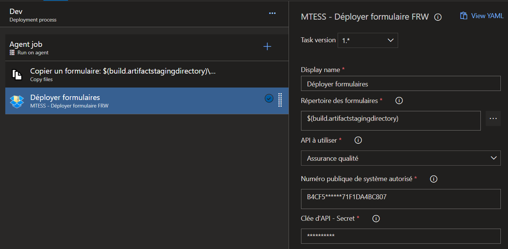
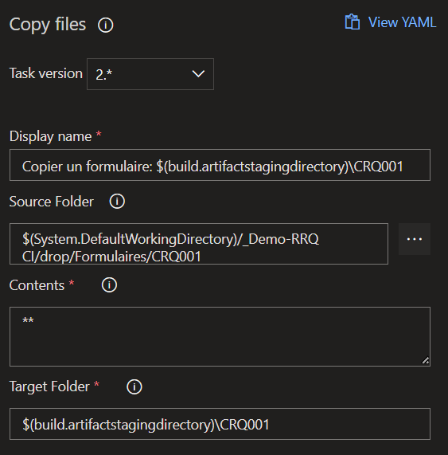
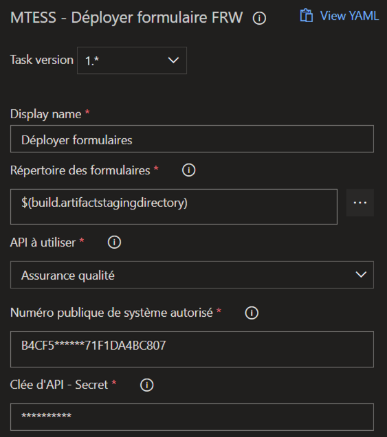

> Consultez la version de cette aide sur [github](https://github.com/MTESSDev/azurepipeline-mtess-frw-deploiement/blob/main/README.md) pour être certain d'utiliser la version la plus à jour.

L'utilisation est aussi simple que n'importe quelle extension DevOps.

Pour débuter il faut installer l'extension, il peut-être nécessaire de la faire ajouter par une équipe d'admin Azure.

Par la suite, elle sera disponible dans la liste des extensions des pipelines de `Build` et de `Release`.



## Déplacer d'abord les fichiers d'un seul formulaire dans un répertoire



Dans l'exemple ci-haut, nous copions le répertoire `CRQ001` depuis notre "drop" (dépôt drop créé lors d'un build déclenché au commit) git vers le répertoire de staging du même nom soit `CRQ001`.

#### Exemple d'arborescence
```yaml
📁 staging
│    default.v0.yml  #(facultatif, s'appliquera à TOUS les formulaires)  
│    transmission.v0.yaml #(facultatif, s'appliquera à TOUS les formulaires)    
│
└──📁 CRQ001
│  │   CRQ001.v1.form.yml
│  │   CRQ001.v1.bind.yml #(facultatif)
|  |   CRQ001.v0.transmission.yml #(facultatif)
│  │
│  └──📁 Gabarits #(facultatif)
│     │   formulaire.pdf
│     │   gabarit.docx
│     │   etc ...
│   
└──📁 AUTREFORM
   │   AUTREFORM.v1.form.yml
   │   etc...
```

> Cette étape permet de ne sélectionner qu'un seul formulaire, si vous désirez déployer plus d'un formulaire à toutes les fois, il est possible de sélectionner plus d'un dossier. Notez cependant que l'arborescence finale dans votre staging doit être d'un répertoire par formulaire (chaque répertoire de formulaire contenant ses fichiers de config. form, transmission et autres)

## Nettoyage

`à venir bientôt` 

Il est maintenant possible pour vous de "nettoyer" (supprimer le répertoire) des formulaires devenus désuets, par exemple des formulaires de tests. 

Pour ce faire, il suffit d'inclure un fichier nommé `nettoyage.yml` dans un des répertoires déployés ou à la racine.

La syntaxe à respecter à l'intérieur du fichier est la suivante : 

```yaml
nettoyer:
  dossiersFormulaire:
    - TESTFORM1
    - TESTFORM2
    - MACFORM
```
Les répertoires correspondants seront supprimés puis le reste du déploiement s'effectue normalement.

## Lancez ensuite l'outil de déploiement des formulaires

Voici un exemple de configuration avec l'interface graphique:



Si vous configurez cette étape en `YAML` voici la config à inscrire:

```yaml
- task: MTESS.mtess-frw-deploiement.Deploiement.MTESSDeploiement@1
  displayName: 'Déployer formulaires '
  inputs:
    sourceDir: '$(build.artifactstagingdirectory)'
    apiSiteWeb: PROD #QA (par défaut), PROD ou une adresse manuelle.
    noPublicSystemeAutorise: 'B4CF5******71F1DA4BC807'
    apiKey: '**********'
```

Il suffit ensuite de spécifier le répertoire de staging (lorsque que celui-ci contient seulement les formulaires que nous voulons déployer)

Il faut inscrire dans l'interface ou dans le `YAML`

- Le répertoire source
- Le palier de déploiement voulu (QA ou PROD)
- Votre numéro public de système autorisé (normalement un GUID)
- Votre clée API privée (il est fortement suggéré de la passer en varaible de déploiement de type `SECRET` pour que personne le puisse la récupérer plus tard)

## Lancer le pipeline nouvellement créé

Une fois le traitement complété, vous devriez retrouver votre formulaire sur le serveur en inscrivant une URL comme:
https://formulaires.mtess.gouv.qc.ca/Form/$1/$2

1. Est votre id numérique de système autorisé (ex: 1)
2. Est le nom du dossier donné lors du déploiement (ci-haut `CRQ001`), gardez vos noms de formulaires _simples_ et _concis_.

## Pour compiler cet outil (uniquement pour les développeurs de l'extension)

Pour compiler et produire le .vsix il suffit de faire :

Prérequis : Installer node (npm)

Installer npx

```
npm install -g npx
```
Lancer le build de l'extension

```
npx tfx-cli extension create
```
